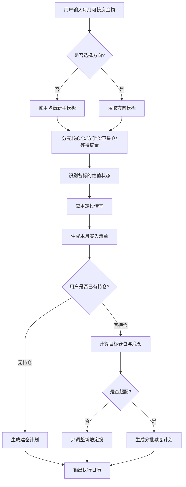
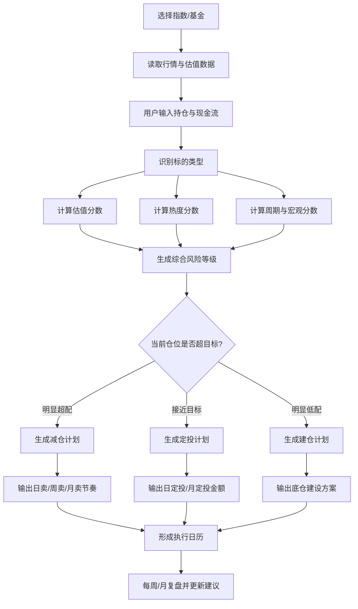
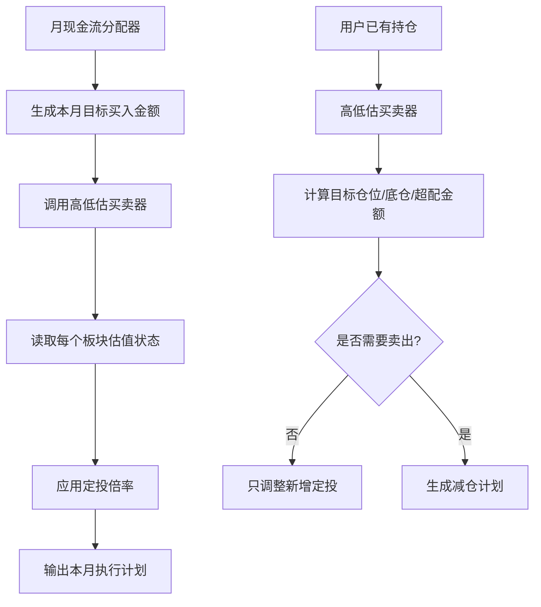
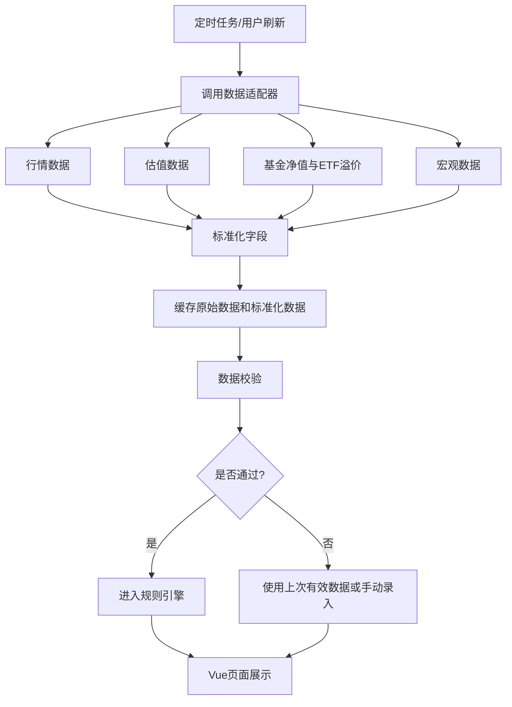

# 指数基金估值与定投决策系统流程文档

## 1. 项目定位

这个 Vue 项目应该定位为“指数基金投资纪律工具”，而不是“预测涨跌工具”。

它要解决的核心问题不是明天涨不涨，而是：

- 小白每个月有一笔钱，应该怎么分配到核心资产、防守资产和成长资产。
- 某个指数处于低估、合理、高估、过热时，应该买多少、暂停多少、留多少现金。
- 已经持有高位资产时，到底是继续定投、停止定投、减仓到目标仓位，还是只保留底仓。
- 当市场大跌时，用户知道什么时候恢复正常定投，什么时候提高定投。

产品的一句话原则：

```text
先配置，再估值；先仓位，再买卖；先纪律，再预测。
```

所有输出仅用于投资分析、教育和自我决策辅助，不构成具体投资顾问建议。

## 2. 来自三类书的底层原则

### 2.1 《指数基金投资指南》的启发

适合转化为产品规则的部分：

- 指数基金比个股更适合普通人长期投资。
- 买低成本、分散度高、规则透明的指数。
- 估值不是用来猜明天，而是用来调整买入速度。
- 低估时多买，合理时正常买，高估时少买或暂停，过热时控制仓位。

需要警惕的地方：

- 不能把“低估”机械理解成一定涨。
- 行业指数和主题指数不能当作核心仓位。
- 估值百分位要结合盈利周期，否则容易买到周期陷阱。

### 2.2 《简单致富》的启发

适合转化为产品规则的部分：

- 普通人最重要的是长期、低成本、分散、少折腾。
- 资产配置比频繁择时更重要。
- 投资系统应该尽量简单，让用户能坚持。
- 现金流定投比一次性猜底更适合新手。

需要警惕的地方：

- 这类极简策略适合成熟市场宽基，对高波动主题指数不能完全照搬。
- 中国投资者还要考虑 A 股、港股、QDII 溢价、汇率和交易限制。

### 2.3 《聪明的投资者》的启发

适合转化为产品规则的部分：

- 价格和价值要分开。
- 安全边际不是口号，而是买入价格、仓位和分散度共同形成的保护。
- 市场情绪会周期性地从悲观到狂热，投资者要用规则对抗情绪。
- 防御型投资者应该优先选择可理解、低成本、分散的组合。

需要警惕的地方：

- 格雷厄姆式低估值思维不能直接替代指数基金的长期配置思维。
- 低 PB、低 PE 资产可能是价值陷阱，尤其是盈利下行、ROE 下降、分红不可持续时。

## 3. 对项目思路的专业评价

### 3.1 值得做的地方

这个项目有价值，因为它把投资中最难执行的部分产品化了：

- 把“我感觉贵了”变成估值分位、热度分数和仓位规则。
- 把“我是不是该卖”变成目标仓位、底仓和超配金额计算。
- 把“定投还要不要继续”变成定投倍率。
- 把“我每个月能投多少钱”变成自动现金流分配。

这比单纯展示 PE、PB 更有用，因为小白真正缺的不是指标，而是指标之后该怎么做。

### 3.2 最大弊端

| 弊端 | 说明 | 优化方式 |
|---|---|---|
| 容易变成择时工具 | 用户可能每天盯分数，频繁买卖 | 只允许月度大调整，日度只做执行 |
| 指标有伪精确感 | 估值分数不是未来收益保证 | 输出置信区间和风险提示 |
| 低估可能是陷阱 | 红利、银行、地产、周期股低估可能来自盈利恶化 | 加入 ROE、盈利趋势、分红覆盖率 |
| 高估可能继续涨 | 纳指、AI、优质科技可能长期高估 | 高估不清仓，只降速和再平衡 |
| 主题指数风险过高 | 科创50、半导体、CPO 波动大 | 作为卫星仓，限制最大仓位 |
| 数据源不稳定 | 估值、溢价、历史分位口径不一 | MVP 先手动录入，后续标注数据来源 |
| 合规风险 | 自动给具体买卖建议可能被理解为投顾 | 定位为教育和自我规划工具，保留用户确认 |

## 4. 标的池优化

原文档中提到纳斯达克100、科创50、沪深300、中证红利、中证500/1000，这个方向是对的，但需要分层。

### 4.1 核心仓

核心仓是普通小白最应该长期持有的部分，要求分散度高、长期逻辑稳、费用低。

| 类型 | 例子 | 作用 | 建议定位 |
|---|---|---|---|
| A 股核心宽基 | 沪深300、中证A500、中证800、全市场指数 | 中国权益核心仓，享受本土经济和政策周期 | 主仓之一 |
| 美股/全球核心宽基 | 标普500、全球股票指数、发达市场指数 | 分散单一市场风险，配置全球优质公司 | 主仓之一 |
| 债券/货币 | 中短债、货币基金、现金管理 | 降低波动，提供回调资金 | 防守仓 |

核心仓原则：

```text
新手组合中，核心仓应该占权益资产的 50%-80%。
核心仓建议采用“A股核心 + 美股/全球核心”的双核心结构，而不是只押单一市场。
```

### 4.2 防守仓

防守仓不是为了暴富，而是为了让用户在熊市中能坚持。

| 类型 | 例子 | 作用 | 风险 |
|---|---|---|---|
| 红利指数 | 中证红利、红利低波、央企红利 | 分红、防守、低估值风格 | 行业集中、成长性弱 |
| 债券基金 | 中短债、政策性金融债 | 降低组合波动 | 利率波动、信用风险 |
| 货币基金 | 现金管理类 | 等待机会和应急 | 收益低 |

红利指数适合做防守仓，但不应该替代所有权益资产。它解决的是“现金流和估值防守”，不是“科技成长”。

### 4.3 卫星仓

卫星仓用于捕捉长期产业趋势，但必须限制比例。

| 类型 | 例子 | 作用 | 建议上限 |
|---|---|---|---:|
| 海外成长 | 纳斯达克100 | AI、云计算、大科技 | 10%-25% |
| 当年市场主线 | 由资金流、相对强弱、产业催化识别出的主线指数或主题 | 捕捉年度主线机会 | 5%-15% |
| 主题行业 | AI、CPO、芯片、创新药、电力设备等候选主题 | 产业弹性，需经过主线识别 | 0%-10% |
| 小盘成长 | 中证1000、中证2000 | 风险偏好修复 | 5%-15% |

卫星仓原则：

```text
看不懂商业逻辑的主题，不进卫星仓。
再看好的主题，也不能变成全部仓位。
新手不直接选择具体热门主题，系统先识别当年主线，再决定是否进入卫星仓。
```

## 5. 小白一键生成方案

用户最少只输入两个信息：

```text
每月可投资金额
想关注的方向：稳健、均衡、成长、红利、美股宽基、当年主线
```

如果用户只输入每月金额，不选择方向，系统默认使用“均衡新手模板”。

### 5.1 默认新手模板

| 资金去向 | 默认比例 | 说明 |
|---|---:|---|
| A 股核心宽基 | 25% | 沪深300、中证A500、中证800等 |
| 美股/全球核心宽基 | 25% | 标普500、全球股票指数、发达市场指数等 |
| 防守仓 | 25% | 红利、债券、货币基金 |
| 成长卫星 | 15% | 纳斯达克、当年主线、创业板等，经系统筛选后进入 |
| 等待资金 | 10% | 用于回调加仓 |

例子：

```text
用户每月可投资 3000 元
A股核心宽基：750 元
美股/全球核心宽基：750 元
防守仓：750 元
成长卫星：450 元
等待资金：300 元
```

### 5.2 按用户选择方向微调

| 用户选择 | A股核心 | 美股/全球核心 | 防守仓 | 成长卫星 | 等待资金 |
|---|---:|---:|---:|---:|---:|
| 稳健 | 20% | 20% | 45% | 5% | 10% |
| 均衡 | 25% | 25% | 25% | 15% | 10% |
| 成长 | 25% | 30% | 15% | 20% | 10% |
| 红利 | 20% | 20% | 45% | 5% | 10% |
| 美股宽基 | 20% | 35% | 20% | 15% | 10% |
| 当年主线 | 25% | 25% | 25% | 15% | 10% |

注意：即使用户选择“当年主线”，也不应该把 100% 月投资额投进去。产品要默认保护小白。

这里的“美股/全球核心”优先指向标普500、全球股票指数或发达市场指数；纳斯达克100更适合放在成长卫星里做增强，不建议作为新手唯一海外核心仓。

当年主线不是固定等于科创、半导体或 AI。系统应该每年、每季根据资金和产业信号识别主线候选，再决定卫星仓配置。例如某一年主线可能是 AI 算力，另一年可能是红利低波、出海制造、创新药、电力设备、资源品或消费复苏。

### 5.3 当年主线识别规则

当年主线应该由系统识别，而不是让小白直接猜。

主线评分维度：

| 维度 | 权重 | 判断内容 |
|---|---:|---|
| 资金方向 | 30% | ETF份额变化、成交额、北向/机构资金、行业资金流 |
| 相对强弱 | 20% | 近3个月、6个月相对沪深300/中证全指是否持续占优 |
| 产业验证 | 20% | 订单、业绩、景气度、库存周期、价格趋势是否验证 |
| 政策与事件催化 | 15% | 政策支持、产业会议、技术突破、资本开支变化 |
| 估值与热度约束 | 15% | 估值是否已经过热，拥挤度是否过高 |

主线状态：

```text
资金刚流入 + 估值不高 = 可作为卫星候选
资金持续流入 + 业绩验证 = 可提高到卫星仓上限
资金极度拥挤 + 估值过热 = 只观察或降速
只有故事没有资金和业绩 = 不进入主线池
```

主线池输出不直接等于买入。它只告诉用户：

```text
当前主线候选是什么
处于预期驱动、订单验证、业绩兑现、扩产竞争还是过热阶段
适合放多少卫星仓
是否已经过热需要等待回调
```

## 6. 估值状态如何影响月度方案

每个板块有一个定投倍率。月度买入金额不是固定不变，而是：

```text
实际买入金额 = 目标月投金额 * 定投倍率
未买入部分进入等待资金或货币基金
```

| 估值状态 | 定投倍率 | 产品动作 |
|---|---:|---|
| 低估冷静 | 150% | 多买，动用部分等待资金 |
| 合理 | 100% | 正常定投 |
| 偏贵 | 50% | 降速定投 |
| 高估 | 30% | 只保留参与权 |
| 过热 | 0%-10% | 暂停或象征性买入 |
| 逻辑破坏 | 0% | 不因便宜而买 |

例子：用户每月 3000 元，选择纳斯达克方向。

```text
成长卫星目标金额 = 3000 * 20% = 600 元
如果纳斯达克处于高估状态，定投倍率 = 30%
本月实际买入纳斯达克 = 600 * 30% = 180 元
剩余 420 元进入等待资金
```

这就是“高位仍可小额定投”的原因：不是重仓追高，而是保留长期参与权。

### 6.1 月定投、周定投、日定投的推荐

产品默认推荐：

```text
月度做决策，周度做执行，日度只用于高波动或大金额场景。
```

原因是：小白真正需要的是低频决策和高执行力，而不是每天看盘、每天改策略。

| 用户情况 | 默认执行方式 | 说明 |
|---|---|---|
| 每月可投 1000 元以内 | 月定投或双周定投 | 金额小，保持简单最重要 |
| 每月可投 1000-5000 元 | 周定投 | 推荐默认方案，每月拆成 4 次执行 |
| 每月可投 5000 元以上 | 周定投，可选日定投 | 金额较大时可进一步平滑买点 |
| 核心宽基 | 月定投或周定投 | 沪深300、A500、标普500这类不需要太碎 |
| 高波动卫星 | 周定投或日定投 | 纳斯达克、科创、半导体等可更细分 |
| 高估状态 | 先降低倍率，再决定频率 | 不是把月定投改成日定投就能解决高估问题 |
| QDII 溢价过高 | 暂停或降速 | 溢价风险优先级高于定投频率 |

系统可以给用户三个按钮：

```text
简单模式：每月 1 次
推荐模式：每周 1 次
平滑模式：每个交易日小额买入
```

默认选择“推荐模式：每周 1 次”。页面展示的是本月总计划，执行日历再拆成每周或每日金额。

例子：

```text
用户每月可投 3000 元，系统生成本月买入 2280 元，等待资金 720 元
推荐模式：每周执行 4 次
每周买入金额 = 2280 / 4 = 570 元
等待资金不自动买入，只在触发回调条件时使用
```

### 6.2 A股高波动市场的参数调整

A股不能完全照搬美股宽基的低频长期持有参数。整体上，A股更容易出现：

- 估值和情绪大幅波动。
- 风格轮动更快。
- 政策、流动性、风险偏好影响更强。
- 指数长期收益更多来自“低位敢买 + 高位再平衡”，而不是单纯长期持有不动。

所以同一套系统可以用，但参数要区分市场：

| 市场/标的 | 策略倾向 | 复盘频率 | 再平衡强度 |
|---|---|---|---|
| 美股/全球核心宽基 | 长期持有为主，少折腾 | 月度/季度 | 较弱 |
| A股核心宽基 | 定投 + 估值调速 + 再平衡 | 月度 | 中等 |
| A股红利/低波 | 防守和现金流，防止行业过度集中 | 月度/季度 | 中等 |
| A股当年主线/高波动主题 | 由主线识别器筛选，严格仓位上限 | 每周观察、月度调整 | 较强 |

A股核心原则：

```text
A股不适合每天猜涨跌，但适合用估值和仓位做更积极的再平衡。
低估时多买，高估时少买，涨出超配时把仓位拉回目标。
```

### 6.3 A股年度收益收割再定投策略

用户提到的策略可以作为 A股增强模块：

```text
当年每月正常定投。
年末统计全年已实现/浮动收益。
如果满足收益和估值条件，卖出一部分收益。
把卖出的收益分成 12 份，加入下一年的每月定投。
```

这个策略的本质不是预测顶部，而是“收益再平衡 + 现金流平滑”。它更适合震荡明显、估值波动大的市场，尤其是 A股宽基、红利、部分周期风格指数。

不建议机械地“只要年底赚钱就全部卖收益”。更稳的触发条件是：

| 条件 | 动作 |
|---|---|
| 年度收益为正，但估值仍低 | 不收割或只收割 0%-20% |
| 年度收益超过 8%-15%，估值合理偏高 | 收割收益的 30%-50% |
| 年度收益较高，估值分位超过 70% | 收割收益的 50%-70% |
| 估值分位超过 85%，且仓位超目标 | 可收割收益并额外再平衡 |
| 年度亏损或仓位低于目标 | 不收割，继续定投或低位加仓 |

收益收割计算：

```text
年度可收割收益 = max(0, 年末A股该模块市值 - 年内累计投入本金 - 年初本金基准)
建议收割金额 = 年度可收割收益 * 收割比例
下一年每月增强定投 = 建议收割金额 / 12
下一年月定投金额 = 原计划月定投金额 + 下一年每月增强定投
```

例子：

```text
A股核心宽基原计划每月定投 1000 元
全年投入 12000 元
年末该模块浮盈 2400 元
估值分位 75%，属于合理偏高
系统建议收割收益的 50% = 1200 元
下一年每月增强定投 = 1200 / 12 = 100 元
下一年A股核心宽基月定投 = 1000 + 100 = 1100 元
```

这个策略适合放在产品里的“年度收益收割器”，但不建议作为全市场默认策略。

适用场景：

- A股核心宽基、红利、周期风格指数。
- 用户容易在盈利后不知如何处理。
- 用户希望有明确的年度复盘动作。
- 市场估值已经合理偏高或高估。

不适用场景：

- 美股/全球核心宽基长期主仓。
- 处于产业主升浪早中期的纳斯达克100。
- 低估区刚启动的A股宽基。
- 科创、半导体等高波动主题已经亏损或仓位低配时。

最大弊端：

```text
如果市场进入单边牛市，过早收割会降低复利。
如果不看估值，只按年底机械卖出，容易卖在主升浪中段。
如果基金有赎回费、QDII溢价或交易成本，频繁收割会损耗收益。
```

产品建议：

```text
把“年度收益收割再定投”做成A股增强策略开关。
默认不开启；用户选择A股增强模式时开启。
开启后也必须同时满足收益、估值和仓位条件，不能机械卖出。
```

## 7. 底仓规则优化

底仓不是越多越好。底仓是长期趋势没有破坏时，为了不被市场甩下车而保留的最低仓位。

### 7.1 底仓占目标仓位比例

| 标的类型 | 底仓占目标仓位 |
|---|---:|
| A 股核心宽基 | 50%-70% |
| 海外核心宽基 | 50%-70% |
| 红利指数 | 60%-80% |
| 纳斯达克100 | 30%-50% |
| 科创50/创业板 | 20%-40% |
| 半导体/AI/CPO等主题 | 0%-30% |

### 7.2 什么时候建底仓

| 市场状态 | 建底仓方式 |
|---|---|
| 低估 | 可以较快建到底仓的 70%-100% |
| 合理 | 3-6 个月分批建到底仓 |
| 偏贵 | 只建底仓的 30%-50% |
| 高估 | 只建观察仓或底仓的 20%-30% |
| 过热 | 不主动建底仓，等待回调或只象征性买入 |

### 7.3 小白版解释

```text
底仓解决的是“怕踏空”。
等待资金解决的是“怕买贵”。
再平衡解决的是“涨多了不知道卖多少”。
```

## 8. 卖出规则优化

卖出必须先看用户是否已经持有，而不是只看指数高不高。

### 8.1 三种用户场景

| 场景 | 动作 |
|---|---|
| 没有持仓 | 不谈卖出，只决定建仓速度 |
| 持仓接近目标 | 不卖，只调整新增定投 |
| 持仓明显超过目标 | 计算超配金额，分批减仓 |

### 8.2 卖出金额计算

```text
目标持仓金额 = 总资产 * 目标仓位
底仓金额 = 目标持仓金额 * 底仓比例
超配金额 = 当前持仓金额 - 目标持仓金额
可卖金额 = 当前持仓金额 - 底仓金额
建议卖出金额 = max(0, min(超配金额, 可卖金额))
```

### 8.3 卖出节奏

| 条件 | 节奏 |
|---|---|
| 轻微超配，估值偏贵 | 每月再平衡一次 |
| 明显超配，估值高估 | 分 4-8 周卖出 |
| 严重超配，估值过热 | 分 10-20 个交易日卖出 |
| QDII 溢价异常高 | 优先卖出溢价高的场内份额 |
| 未超配 | 不为了猜顶部而卖 |

日卖出只适合“严重超配 + 过热 + 用户承受不了回撤”的情况。大多数小白更适合月度再平衡。

## 9. 自动生成方案流程图



## 10. 页面输出格式

首页不要堆太多指标，小白只看五件事：

```text
1. 本月总投资金额
2. 本月买什么，各买多少钱
3. 哪些暂停，钱先放哪里
4. 当前是否需要减仓，卖多少
5. 下次触发加仓/减仓的条件
```

示例输出：

```text
本月可投：3000 元
当前风格：纳斯达克方向，系统按新手保护规则处理

本月计划：
- A股核心宽基：600 元
- 美股/全球核心宽基：900 元
- 防守仓：600 元
- 纳斯达克100：180 元
- 等待资金：720 元

原因：
- 纳斯达克处于高估区，成长卫星只按 30% 速度买入
- 未投入的 420 元进入等待资金
- 保留长期参与权，但不在高位重仓追买

触发条件：
- 纳斯达克回调 10%-15%：恢复正常定投
- 回调 20%-30% 且盈利逻辑未破坏：提高定投
- 如果已有仓位超过目标 130%：启动分批减仓
```

### 10.1 界面解释与提示要求

每个建议卡片都必须包含“为什么”，不能只给买卖金额。

建议卡片标准结构：

```text
结论：本月纳斯达克只买 180 元
原因：当前估值处于高估区，系统把成长卫星定投倍率降到 30%
好处：保留长期参与权，但避免高位重仓追买
风险：如果后续继续上涨，低速定投可能跑输满仓买入
触发条件：回调 10%-15% 恢复正常定投
```

页面提示分四类：

| 提示类型 | 作用 | 示例 |
|---|---|---|
| 原因提示 | 告诉用户为什么这么做 | “因为估值分位超过80%，系统降低新增买入。” |
| 风险提示 | 告诉用户这个建议可能错在哪里 | “高估不代表马上下跌，完全清仓可能踏空。” |
| 触发提示 | 告诉用户下一步什么时候改变 | “回调15%或估值回到合理区，恢复正常定投。” |
| 反例提示 | 防止用户机械理解规则 | “低PB不一定安全，如果ROE下滑可能是价值陷阱。” |

### 10.2 关键页面的解释内容

| 页面 | 必须解释的内容 |
|---|---|
| 本月投资计划 | 为什么这样分配到A股、美股、防守仓和卫星仓 |
| 高低估买卖器 | 为什么提高/降低定投倍率，为什么卖或不卖 |
| 组合体检 | 哪个资产超配，超配来自上涨还是手动买多 |
| 高位减仓模拟器 | 卖出金额怎么算，为什么卖到目标仓位而不是清仓 |
| 回调加仓模拟器 | 回调多少买，买的钱来自哪里，什么情况下不加仓 |
| 年度收益收割器 | 为什么收割收益，为什么不是全部卖出，第二年如何摊回去 |

### 10.3 面向小白的文案原则

```text
少用术语，多用因果。
先说结论，再说原因。
先说本月怎么做，再说长期逻辑。
每个买入建议都要说明“如果判断错了会怎样”。
每个卖出建议都要说明“卖到哪里停止”。
```

示例文案：

```text
当前A股核心宽基处于合理偏低区，但没有进入明显低估。
系统建议保持正常周定投，不一次性买入。
这样做的原因是：价格有一定安全边际，但还没有便宜到值得动用大量等待资金。
如果后续回调10%，系统会把等待资金的30%加入定投。
如果后续上涨并导致仓位超过目标120%，系统会提示月度再平衡。
```

## 11. 指标系统优化

### 11.1 标的评分

每个候选指数基金不只看收益率，要按 100 分评分：

| 维度 | 权重 | 说明 |
|---|---:|---|
| 分散度与指数质量 | 25% | 成分股数量、行业集中度、指数规则 |
| 费用与跟踪误差 | 20% | 管理费、托管费、跟踪偏离 |
| 估值安全边际 | 20% | PE/PB/股息率历史分位 |
| 流动性与溢价 | 15% | 成交额、规模、QDII 溢价 |
| 盈利与分红质量 | 10% | ROE、盈利趋势、分红稳定性 |
| 宏观适配度 | 10% | 利率、汇率、流动性环境 |

### 11.2 热度评分

| 指标 | 加分 |
|---|---:|
| 距离 52 周高点很近 | +10 到 +20 |
| 近 3-6 个月涨幅过大 | +10 到 +20 |
| 估值百分位高 | +10 到 +25 |
| ETF 溢价率高 | +10 到 +20 |
| 成交额异常放大 | +5 到 +10 |
| 社交媒体和新闻过热 | +5 到 +10 |

热度不是卖出信号，它只是仓位调节信号。

## 12. MVP 开发优先级

### 第一阶段：本地规则版

先不接实时行情，重点把规则跑通。

1. 用户输入每月可投资金额。
2. 用户选择方向，默认均衡。
3. 系统生成月度配置。
4. 用户手动输入估值状态。
5. 系统生成定投倍率、等待资金、底仓和卖出计划。

### 第二阶段：半自动数据版

1. 接入指数估值数据。
2. 接入基金净值、ETF 溢价和规模数据。
3. 自动计算估值百分位。
4. 加入本地持仓记录。

数据接入原则：

```text
先手动录入，后半自动抓取；先缓存校验，再展示给用户；先标注来源，再参与计算。
```

不建议前端直接请求第三方行情接口。更稳的做法是加一层数据适配器：

```text
第三方数据源 -> 后端抓取/定时任务 -> 标准化数据表 -> 规则引擎 -> Vue 页面
```

数据分层：

| 数据类型 | 用途 | 推荐来源策略 |
|---|---|---|
| 指数行情 | 价格、涨跌幅、52周位置 | 交易所/指数公司/合规行情源，个人版可先用公开行情源 |
| 指数估值 | PE、PB、股息率、历史分位 | 指数公司、基金公司、第三方估值平台，必须记录口径 |
| 基金净值 | 场外基金净值、QDII净值 | 基金公司公告、基金销售平台、公开基金数据 |
| ETF价格 | 场内价格、成交额、溢价率 | 交易所行情、券商/行情数据源 |
| 宏观数据 | 美债收益率、美元、利率、通胀 | FRED、美联储、美国财政部、央行等官方源 |
| 汇率 | QDII和海外资产折算 | 央行、外汇交易中心、合规行情源 |

MVP 阶段可以允许用户手动录入估值状态；数据接入后，系统也要保留“手动覆盖”能力，因为不同平台的 PE/PB 口径会不一致。

### 第三阶段：组合管理版

1. 多标的组合再平衡。
2. 回调加仓提醒。
3. 高估减仓提醒。
4. 执行日历。
5. 历史回测和压力测试。

## 13. 规则引擎伪代码

```ts
type Style = "conservative" | "balanced" | "growth" | "dividend" | "usCore" | "mainline";
type MarketState = "cheap" | "fair" | "expensive" | "high" | "overheated" | "broken";

const templates = {
  conservative: { chinaCore: 0.20, globalCore: 0.20, defensive: 0.45, satellite: 0.05, reserve: 0.10 },
  balanced: { chinaCore: 0.25, globalCore: 0.25, defensive: 0.25, satellite: 0.15, reserve: 0.10 },
  growth: { chinaCore: 0.25, globalCore: 0.30, defensive: 0.15, satellite: 0.20, reserve: 0.10 },
  dividend: { chinaCore: 0.20, globalCore: 0.20, defensive: 0.45, satellite: 0.05, reserve: 0.10 },
  usCore: { chinaCore: 0.20, globalCore: 0.35, defensive: 0.20, satellite: 0.15, reserve: 0.10 },
  mainline: { chinaCore: 0.25, globalCore: 0.25, defensive: 0.25, satellite: 0.15, reserve: 0.10 },
};

function getDcaMultiplier(state: MarketState) {
  if (state === "cheap") return 1.5;
  if (state === "fair") return 1;
  if (state === "expensive") return 0.5;
  if (state === "high") return 0.3;
  if (state === "overheated") return 0.1;
  return 0;
}

function generateMonthlyPlan(monthlyAmount: number, style: Style, satelliteState: MarketState) {
  const template = templates[style] ?? templates.balanced;
  const satelliteTarget = monthlyAmount * template.satellite;
  const multiplier = getDcaMultiplier(satelliteState);
  const satelliteBuy = satelliteTarget * multiplier;
  const unusedSatellite = satelliteTarget - satelliteBuy;

  return {
    chinaCoreBuy: monthlyAmount * template.chinaCore,
    globalCoreBuy: monthlyAmount * template.globalCore,
    defensiveBuy: monthlyAmount * template.defensive,
    satelliteBuy,
    reserve: monthlyAmount * template.reserve + Math.max(0, unusedSatellite),
  };
}

function getExecutionFrequency(monthlyAmount: number, volatility: "low" | "medium" | "high") {
  if (monthlyAmount <= 1000) return "monthly";
  if (monthlyAmount <= 5000) return "weekly";
  if (volatility === "high") return "daily";
  return "weekly";
}

function getSellPlan(input: {
  totalAssets: number;
  currentAmount: number;
  targetWeight: number;
  baseRatio: number;
  heatScore: number;
}) {
  const targetAmount = input.totalAssets * input.targetWeight;
  const baseAmount = targetAmount * input.baseRatio;
  const overweight = input.currentAmount - targetAmount;
  const sellable = input.currentAmount - baseAmount;
  const suggestedSell = Math.max(0, Math.min(overweight, sellable));

  if (suggestedSell <= 0) return null;

  const days = input.heatScore >= 85 ? 20 : input.heatScore >= 70 ? 40 : 60;

  return {
    suggestedSell,
    dailySellAmount: suggestedSell / days,
    stopAtAmount: Math.max(targetAmount, baseAmount),
    days,
  };
}
```

## 14. 最终产品标准

这个项目做得好的标准不是“收益最高”，而是：

- 小白知道每个月买什么、买多少、为什么。
- 高位时不会一把梭。
- 低位时不会完全不敢买。
- 已经赚多了时知道减到哪里。
- 市场暴跌时知道等待资金怎么用。
- 组合长期保持分散、低成本、可坚持。

最终目标：

```text
用户只输入每月可投资金额和关注方向，系统自动生成一份可执行、可复盘、可解释的指数基金方案。
```

## 15. 双板块产品架构

产品可以拆成两个核心板块：

```text
板块一：高低估买卖器
板块二：月现金流分配器
```

两者共用同一套估值、热度、周期和仓位规则，但面向的问题不同。

### 15.1 板块一：高低估买卖器

这个板块解决的是“某一个指数现在贵不贵，我该买多少或卖多少”。

适合场景：

- 用户已经持有纳斯达克、科创50、红利指数、沪深300等。
- 用户想知道某个指数是否高估。
- 用户想知道高位后是暂停定投、减仓，还是只保留底仓。
- 用户想知道每天卖多少份、每周卖多少、卖到哪里停。

最少输入：

```text
指数/基金名称
当前持仓金额
总资产
目标仓位
每月原计划定投金额
```

进阶输入：

```text
PE/PB历史百分位
股息率
近一年涨跌幅
ETF溢价率
用户最大可承受回撤
```

输出结果：

```text
当前状态：低估 / 合理 / 偏贵 / 高估 / 过热
建议动作：提高定投 / 正常定投 / 降速定投 / 暂停 / 减仓
定投倍率：150% / 100% / 50% / 30% / 0%-10%
底仓金额：应该至少保留多少
卖出金额：如果超配，建议卖多少
卖出节奏：日卖 / 周卖 / 月度再平衡
触发条件：回调多少恢复买入，继续上涨多少再平衡
```

页面结构：

| 区域 | 内容 |
|---|---|
| 顶部结论 | 当前状态、建议动作、风险等级 |
| 指标卡片 | PE、PB、股息率、估值百分位、热度分数 |
| 仓位诊断 | 当前仓位、目标仓位、底仓、超配金额 |
| 买入建议 | 日定投、周定投、月定投金额 |
| 卖出建议 | 总卖出金额、每日/每周/月度卖出节奏 |
| 触发条件 | 回调加仓、估值过热、溢价过高提示 |

核心保护规则：

```text
没有持仓时，不输出卖出计划。
未超配时，不建议为了猜顶部而卖出。
高估但长期逻辑未破坏时，优先降速定投，而不是清仓。
过热且严重超配时，才启动日卖出。
```

完整闭环流程：



这里的“每周/月复盘”不是可有可无的提醒，而是产品闭环：

- 每周复盘：检查价格、溢价、热度、是否触发回调加仓或高位减仓。
- 每月复盘：检查目标仓位、实际仓位、现金流分配、是否需要再平衡。
- 大多数用户不应该每天改策略，日度只用于执行，周/月才用于调整。

### 15.2 板块二：月现金流分配器

这个板块解决的是“小白每个月能投多少钱，系统自动帮他分到哪里”。

这是新手主入口。用户可以完全不懂 PE、PB，只输入：

```text
每月可投资金额
投资风格：稳健 / 均衡 / 成长 / 红利 / 美股宽基 / 当年主线
```

系统自动生成：

```text
A股核心宽基买多少
美股/全球核心宽基买多少
防守仓买多少
成长卫星买多少
等待资金留多少
哪些板块高估要降速
哪些板块低估可以提高定投
```

默认输出例子：

```text
用户每月可投 3000 元，选择纳斯达克方向

A股核心宽基：600 元
美股/全球核心宽基：900 元
防守仓：600 元
纳斯达克100：180 元
等待资金：720 元

原因：
纳斯达克处于高估区，成长卫星只按 30% 买入。
未买入的 420 元进入等待资金。
```

页面结构：

| 区域 | 内容 |
|---|---|
| 输入区 | 每月可投金额、投资风格、风险承受能力 |
| 自动分配 | 核心仓、防守仓、卫星仓、等待资金 |
| 估值修正 | 根据各板块估值调整实际买入金额 |
| 执行计划 | 本月买入清单、默认周执行、可切换日定投/月定投 |
| 解释区 | 为什么这么分，哪些钱暂时不买 |
| 下次动作 | 回调、上涨、估值变化后的规则 |

核心保护规则：

```text
即使用户选择单一热门方向，也默认保留核心仓和防守仓。
高估板块未买入的钱，进入等待资金，不强行分配到同一板块。
主题指数只进入卫星仓，不作为小白默认核心仓。
现金流分配器只调整新增资金，不默认卖出现有持仓。
```

## 16. 两个板块的关系



关系总结：

```text
月现金流分配器 = 每月怎么买
高低估买卖器 = 单个标的买多少、卖多少
组合体检 = 两者合并后的总仓位是否合理
```

产品首页可以这样设计：

| 主入口 | 面向用户问题 |
|---|---|
| 本月怎么投 | 我这个月有多少钱，应该买什么 |
| 某个指数贵不贵 | 纳指/红利/当年主线指数现在还能不能买 |
| 我的仓位健康吗 | 有没有超配，需不需要再平衡 |
| 高位怎么卖 | 卖多少、卖几天、卖到哪里停 |
| 下跌怎么加 | 回调 10%、20%、30% 分别买多少 |
| 当年主线是什么 | 资金正在流向哪里，是否已经过热 |

## 17. 多板块工具扩展

在两个核心板块之上，可以扩展为五个工具：

### 17.1 本月投资计划

主入口，面向小白。

```text
输入：每月可投资金额 + 风格
输出：本月买入清单 + 等待资金 + 执行日期
```

### 17.2 高低估买卖器

单标的诊断工具。

```text
输入：指数、估值、持仓、目标仓位
输出：买入倍率、底仓、减仓金额、卖出节奏
```

### 17.3 当年主线识别器

识别资金和产业主线，避免新手凭印象追热门主题。

```text
输入：行业/主题候选池、资金流、相对强弱、估值、业绩验证
输出：主线候选、所处阶段、是否过热、建议卫星仓比例
```

### 17.4 组合体检

检查整体资产配置。

```text
输入：所有持仓
输出：核心仓/防守仓/卫星仓是否失衡
```

### 17.5 回调加仓模拟器

提前设置下跌时怎么做，避免真正下跌时情绪失控。

```text
回调 10%：恢复正常定投
回调 20%：动用 30%-50% 等待资金
回调 30%：若逻辑未破坏，动用剩余等待资金分批买入
```

### 17.6 高位减仓模拟器

提前设置上涨后的再平衡规则。

```text
超过目标仓位 120%：月度再平衡
超过目标仓位 130%：分 4-8 周减仓
超过目标仓位 150% 且估值过热：分 10-20 个交易日减仓
```

## 18. Vue 模块拆分建议

建议前端模块这样拆：

```text
src/
  pages/
    Dashboard.vue
    MonthlyCashflow.vue
    ValuationTrader.vue
    PortfolioHealth.vue
    ScenarioSimulator.vue
  components/
    MetricCard.vue
    AllocationTable.vue
    DcaPlanCard.vue
    SellPlanCard.vue
    RiskBadge.vue
    TriggerRules.vue
  rules/
    allocation.ts
    valuation.ts
    dca.ts
    sellPlan.ts
    portfolio.ts
  services/
    marketData.ts
    valuationData.ts
    fundData.ts
    macroData.ts
    dataCache.ts
  data/
    indexPresets.ts
    strategyTemplates.ts
```

规则层要独立于页面，这样后面接真实行情、历史估值和 ETF 溢价时，不需要重写页面。

## 19. 动态数据抓取架构

数据抓取不要直接写进组件。Vue 页面只消费标准化后的数据。

### 19.1 标准数据结构

```ts
type IndexSnapshot = {
  code: string;
  name: string;
  market: "CN" | "US" | "HK" | "GLOBAL";
  price: number;
  changePct: number;
  pe?: number;
  pb?: number;
  dividendYield?: number;
  pePercentile?: number;
  pbPercentile?: number;
  premiumRate?: number;
  volume?: number;
  updatedAt: string;
  source: string;
};
```

### 19.2 抓取流程



### 19.3 数据更新频率

| 数据 | 更新频率 | 说明 |
|---|---|---|
| 场内ETF价格 | 交易时段可实时或延迟 | 用于溢价和执行价格 |
| 场外基金净值 | 每个交易日收盘后 | 用于定投和持仓估算 |
| 指数估值 | 每日或每周 | 不需要分钟级更新 |
| 估值百分位 | 每日收盘后 | 用历史序列重新计算 |
| 美债、美元、利率 | 每日 | 用于宏观风险分数 |
| 用户组合 | 用户操作后更新 | 影响仓位和卖出计划 |

### 19.4 数据源选择原则

数据源按可靠性分层：

```text
第一优先级：交易所、指数公司、基金公司、央行、美联储、FRED 等官方或准官方源
第二优先级：付费行情 API、券商 API、合规数据商
第三优先级：公开网页或非官方接口，仅适合个人学习和 MVP 验证
```

对于国内指数和基金，重点抓：

- 指数点位、PE、PB、股息率、历史分位。
- ETF 场内价格、成交额、溢价率。
- 基金净值、规模、费率、跟踪误差。

对于美股和海外资产，重点抓：

- 标普500、纳斯达克100、全球股票指数的点位和估值。
- 美债收益率、美元指数、联邦基金利率、通胀和就业数据。
- QDII 产品的净值滞后和场内溢价。

产品里必须展示数据来源和更新时间：

```text
数据来源：xxx
更新时间：2026-06-30 15:30
估值口径：TTM PE / PB / 股息率
```

### 19.5 数据异常处理

```text
如果实时数据缺失：使用上一个有效交易日数据。
如果估值口径冲突：提示用户，并采用保守分数。
如果 QDII 溢价异常：优先降低买入金额，而不是继续按原计划买。
如果宏观数据延迟：不影响月度计划，只降低宏观分数置信度。
```
